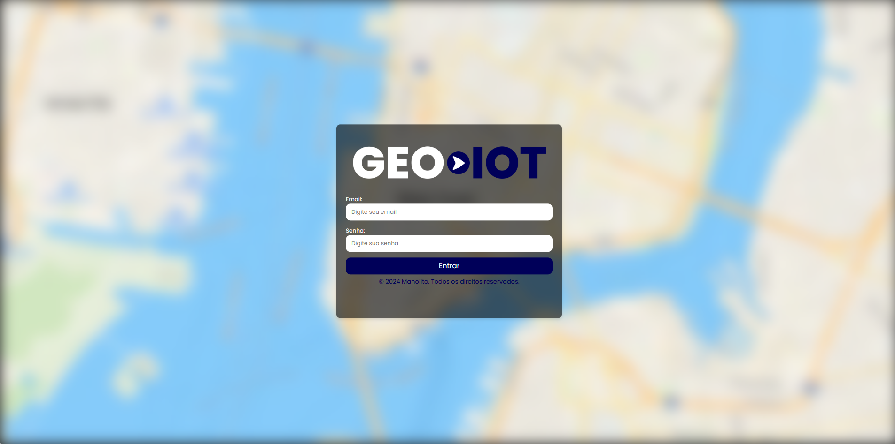
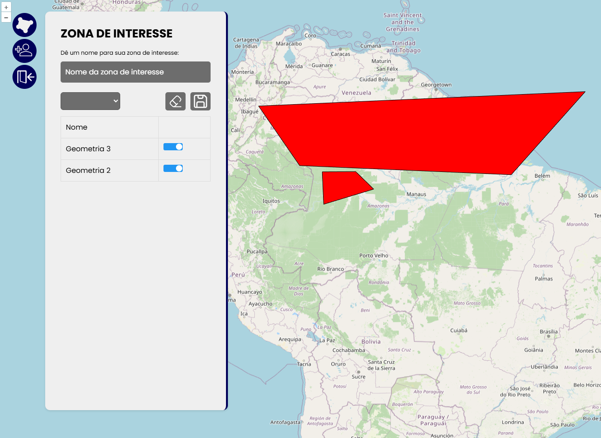

<h1>GeoIOT</h1>

**4º Semestre • Projeto Integrador Fatec-SJC • [Repositório GitHub - client](https://github.com/CauevSilv/web-client-2024-2-GeoIOT) • [ server](https://github.com/CauevSilv/web-server-2024-2-GeoIOT)**  
**Empresa Parceira:** [IT01](https://br.linkedin.com/company/ito1)

 O problema aprensetado pela parceira ITO1 foi a criação de uma aplicação para disponibilizar de maneira visual dados de geolocalização provenientes de dispositivos IOT.
 A equipe Manolito desenvolveu o GeoIot, que exibia de maneira gráfica os dados enviados pelo cliente de uma maneira simples e com distinção de tempo entre coordenadas.

### Funcionalidades
* Criação e Visualização de zonas de interesse, possbilitando a filtragem por geometrias.
* Implementação de autenticação 

#### Tecnologias Utilizadas
- HTML: linguagem de programação para criação de páginas Web;
- CSS: linguagem para aplicação de estilos em códigos HTML;
- TypeScript: linguagem variante de JavaScript que adiciona tipagem ao código;
- Vue.js: framework JavaScript para o desenvolvimento de SPA (Single Page Application) e facilitador na criação de códigos reutilzáveis;
- Java: linguagem de programação orientada a objetos;
- Spring Boot: framework Java para desenvolvimento de Rest APIs;
- PostgresSql: banco de dados com schemas para o DW e para a aplicação.
- IntelliJ IDEA: IDE para desenvolvimento Java;
- WebStorm: IDE da JetBrains focado em front-end. Utilizado para desenvolvimento do front end e para facilitar o debug. Possuí uma ótima integração com o Vue.js;
- DBeaver: ferramenta utilizada para facilitar a visualização do banco;
- Figma: ferramenta utilizada para desenvolvimento de Mockups e Wireframes;
- Discord: ferramenta para comunicação interna do grupo;
- Slack: ferramenta para comunicação com o cliente

#### Contribuições Pessoais
- Desenvolvi o componente principal do projeto, que contém o mapa interativo;
  

- Desenvolvi os métodos utilizados para interação de dados com o mapa, como a exibição de geometrias;
  

- Criei os métodos que permitiam a criação/edição de geometrias diretamente pelo mapa, salvando-as no banco;
  

- Criei os métodos que realizavam operações espaciais entre as geometrias salvas de forma visual.

- Desenvolvi diversas chamadas a API , recebendo e tratando os dados geométricos e temporais em objetos gráficos no mapa;
- Desenvolvi o componente de controle das ferramentas de edição, possibilitando a troca de ferramentas, seleção de geometrias temporárias e exibição de geometrias salvas em banco.

#### Hard Skills
- Spring Boot: sei fazer com autonomia, tanto a parte de Security quanto o Core;
- Oracle: sei fazer com ajuda/consulta;
- TypeScript: sei fazer com autonomia e consigo ajudar outros membros;
- Vue.Js: sei fazer com autonomia e consigo ajudar os outros membros;
- OpenLayers: seu fazer com consulta;

#### Soft Skills
- Iniciativa: tomei a frente do front-end do projeto com os componentes complexos.
- Comunicação: auxiliei o time ensinando como funcionam as relações espaciais e algumas lógicas simples (CONTAINS, TRANSFORM, etc..)
