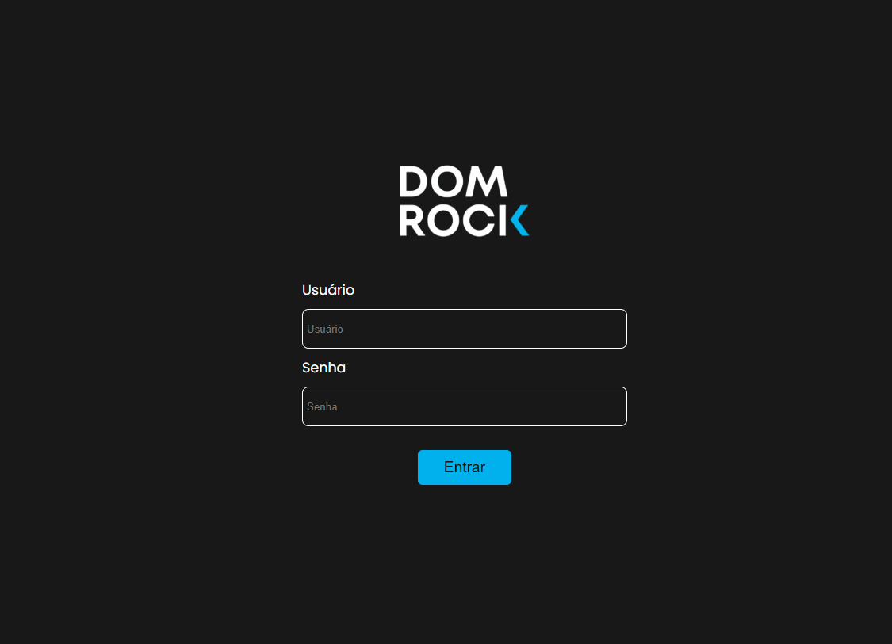

<h1>PipeLine Configurator</h1>

**3º Semestre • Projeto Integrador Fatec-SJC • [Repositório GitHub](https://github.com/CauevSilv/dom-rock-pipeline-configurator)**  
**Empresa Parceira:** [DOM ROCK](https://www.google.com/url?sa=t&source=web&rct=j&opi=89978449&url=https://www.domrock.net/&ved=2ahUKEwifuoi1gNSNAxUvrpUCHXTLPNQQFnoECAoQAQ&usg=AOvVaw17UNge8A_1VmMQvlxEoiHq)

  A equipe Wiz entregou a solução 'Pipeline Configurator', uma aplicação web desenvolvida com front-end Vue.js, servidor Java Spring Boot e banco de dados MySQL.

### Funcionalidades:
- Tratamento inicial dos dados (Landing Zone)
- Definição de Identificadores únicos (Pk's) de forma visual e intuitiva
- Aplicação de regras de negócio e relacionamentos nos dados
  
#### Tecnologias Utilizadas
- HTML: linguagem de programação para criação de páginas Web;
- CSS: linguagem para aplicação de estilos em códigos HTML;
- TypeScript: linguagem variante de JavaScript que adiciona tipagem ao código;
- Vue.js: framework JavaScript para o desenvolvimento facilitador na criação de códigos reutilzáveis;
- Java: linguagem de programação orientada a objetos;
- Spring Boot: framework Java para desenvolvimento de Rest APIs;
- MySQL: simples SGDB da Oracle para armazenamento de dados da aplicação;
- IntelliJ IDEA: IDE para desenvolvimento Java;
- WebStorm: editor focado em front=end. No escopo do projeto utilizado para desenvolvimento de Vue.js e TS;
- Figma: ferramenta utilizada para desenvolvimento de Mockups e Wireframes;
- Discord: ferramenta para comunicação interna do grupo;
- Slack: ferramenta para comunicação com o cliente

#### Contribuições Pessoais
- Desenvolvi algumas das telas do front-end da aplicação, como a tela de criação de usuários, edição de usuários, tabela de usuários e painel do ADM;
- Colaborei com a jornada do dado <Repository, Service, Controller> para várias entidades;
- Desenvolvi as telas de atualização de dados de forma direta na LZ, a tela de configuração da Silver e alguns componentes de demais telas;
- Desenvolvi vários métodos que implementam a regra de negócio requisitada pelo cliente na camada de serviço;

#### Hard Skills
- Java: sei fazer com autonomia;
- Spring Boot: sei fazer com facilidade (Security, JWT, mapeamento de entidades, repositórios, serviços e controllers);
- SQL: sei fazer com autonomia (DDL e DQL);

#### Soft Skills
- Trabalho em equipe: realizei as tarefas, que foram dispostas igualmente entre os membros da equipe considerando o conhecimento de cada um, e ofereci apoio a quem teve dificuldades, evitando 'roubar' a tarefa para mim;
- Comunicação: atualizações em dailies, sprint reviews e reuniões;
- Iniciativa: propus diversas ferramentas e ideias que foram adotadas ao longo do projeto;
- Solução de problemas: desenvolvi e apliquei algumas das regras de negócio do cliente nos serviços;
- Pensamento analítico: análise e tratamento de dados que foram construídos em um objeto para ser facilmente consumido    