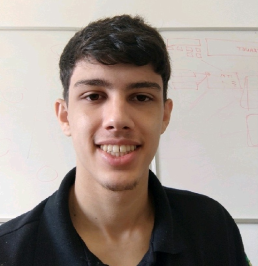
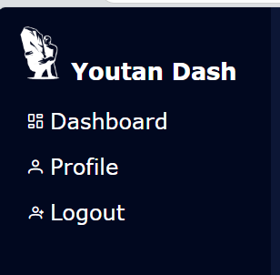
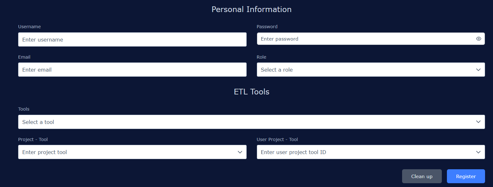
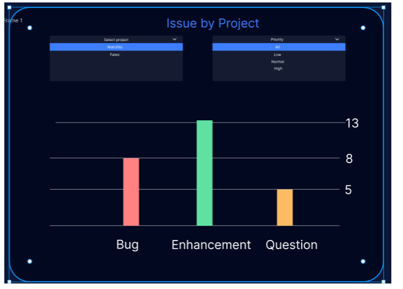

# Cauê Vieira da Silva

## Introdução

Meu nome é Cauê Vieira da Silva, tenho 23 anos e possuo uma formação em Tecnologia da Informação em constante evolução.

Iniciei minha trajetória em 2018 com o curso Técnico em Informática (Colégio Educare). Embora os primeiros contatos com programação tenham me direcionado para outras áreas do TI, em 2023 reafirmei meu foco ao ingressar no curso de Banco de Dados na FATEC São José dos Campos, consolidando meu rumo de carreira.

Minha experiência profissional começou em 2020 na CAOA Chery, onde entrei como Jovem Aprendiz na Manutenção e, rapidamente, demonstrei aptidão para a área de TI, sendo efetivado e migrando para o time de Suporte de TI. Atualmente, atuo na Geopixel como Analista de Suporte e Manutenção de Sistemas. Iniciei como estagiário e fui efetivado em apenas 4 meses, atuando diretamente com Bancos de Dados, VM's e clientes em um ambiente muito movimentado.

## Contatos
* [GIT](https://github.com/CauevSilv)
* [LinkedIn](https://www.linkedin.com/in/caue-vieira-da-silva/)
* [E-mail](mailto:cauevsilva2002@gmail.com)

## Meus Principais Conhecimentos

| **Backend** | **Frontend** | **Bancos de dados** | **Ferramentas** |
| :---: | :---: | :---: | :---: |
|    |     |     |      |

### Meus Projetos

<h1>eVal360</h1>

**1º Semestre • Projeto Integrador Fatec-SJC • [Repositório GitHub - client](https://github.com/CauevSilv/DevMinds)**  
**Empresa Parceira Interna:** PBLTeX

O primeiro projeto desenvolvido durante a graduação foi proposto pela empresa-cliente fictícia PBLTeX com o desafio de desenvolver desenvolver uma aplicação de Avaliação 360° para uso interno da instituição de ensino.

A solução foi entregue pela equipe de desenvolvimento DevMinds na qual atuei como dev. A aplicação desenvolvida era utilizada via terminal e possuia alguns dashboards com uma interface gráfica simples somente para exibição do gráfico.

O projeto teve os seguintes requisitos:
- Autenticação (login)
> Uma comparação dos inputs de email e senha com dados existentes no arquivo 'usersDB.csv' que simula uma tabela de usuários.
- Controle de acesso
> Uma simples verificação do nível do usuário disponível em 'usersDB.csv' que direciona para rotas diferente caso o nível seja de ADM ou User.
- Controle de turmas e times
> Criação de turmas (cursos) e times (equipes) dentro dessas turmas com validação de um usuário por equipe dentro de uma mesma turma.
- Controle de Sprints
> Possibilidade de configuração da quantidade e duração em dias das Sprints durante a criação de uma turma nova.
- Dashboards gerenciais
> Visualização em gráficos para gestores analisarem as notas dos fatores de avaliação de individuos em uma turma e médias de uma turma com identificação visual para fatores com notas acima e abaixo da média.

#### Tecnologias Utilizadas
- Visual Studio Code: editor de código-fonte multifuncional. No escopo do projeto utilizado para desenvolvimento da linguagem Python;
- Python: principal e única linguagem de desenvolvimento em que foi desenvolvida a toda a lógica e regras de negócio da aplicação;
- Matplotlib: biblioteca externa de Python que foi utilizada para a montagem e exibição de gráficos para os dashboards;
- Arquivos CSV: arquivos com propósito de servir como um 'pseudo banco de dados' que substituiram o uso de SGBDs, tecnologia na qual não tinhamos conhecimento no começo do curso;
- ClickUp: ferramenta de gestão de projetos para organização e controle interno da equipe;
- Slack: ferramenta para comunicação com o cliente;
- Miro: ferramenta auxiliar na gestão do projeto em que utilizamos para realizar Brainstorms, Sprint reviews, retrospectivas e técnicas de gerenciamento de projeto como as tabelas SMART e PICK;
- Git e Github: controle de versionamento e hospedagem.

#### Contribuições Pessoais
- Colaborei com os ajustes no login e cadastro;
- Adicionei o suporte ao encoding UTF-8 ao projeto;
- Refiz o componente de leitura e escrita do CSV(banco) do projeto;
- Ajustei diversos pontos do projeto que estavam incorretos.

#### Hard Skills
- Python: aprendi o basico sobre as funções do python e sobre a leitura/escrita de arquivos CSV.

#### Soft Skills
- Comunicação com a equipe: melhorei minha capacidade de interação com a equipe;
- Gerenciamento de tempo: com o SCRUM, aprendi a lidar melhor com o tempo estipulado das tarefas.

<h1>SGTG - Sistema Gerenciador de Trabalhos de Graduação</h1>

**2º Semestre • Projeto Integrador Fatec-SJC • [Repositório GitHub](https://github.com/CauevSilv/API-2-Semestre-DevMinds)**  
**Empresa Parceira Interna:** FATEC

O segundo projeto desenvolvido durante a graduação foi proposto pela própria instituição de ensino com o desafio de criar uma ferramenta para gerenciamento de trabalhos de graduação de uso interno da FATEC.

A solução foi entregue pela equipe de desenvolvimento DevMinds na qual atuei como dev. O SGTG (Sistema Gerenciador de Trabalhos de Graduação) é uma aplicação desktop desenvolvida para uso dos professores que ministram as disciplinas de Trabalho de Graduação. O sistema processa dados de formulários Google Forms em formato CSV e automatiza o gerenciamento acadêmico.

O projeto teve os seguintes requisitos:

- Gerenciamento de matérias e semestres
> Organização e controle das disciplinas de TG por períodos letivos.

- Gestão de alunos matriculados
> Controle de matrículas e vinculação de alunos às respectivas disciplinas.

- Regras de negócio para diferentes tipos de TG
> Aplicação de validações e fluxos específicos conforme a modalidade do trabalho de graduação.

- Sistema de entrega de atividades
> Interface para submissão e acompanhamento de entregas pelos alunos.

- Atribuição de notas e feedbacks
> Funcionalidade para avaliação e retorno de comentários aos estudantes.

- Geração de relatórios
> Produção de documentos e análises sobre o desempenho e progresso dos trabalhos.

- Importação de dados via CSV
> Carga automática de informações a partir de respostas de Google Forms.

#### Tecnologias Utilizadas

- Java: linguagem de programação orientada a objetos utilizada para toda a lógica de negócio e manipulação de dados;
- JavaFX: framework Java para desenvolvimento de interfaces gráficas desktop;
- Scene Builder: ferramenta visual para design e prototipagem rápida de interfaces JavaFX;
- MySQL: sistema de gerenciamento de banco de dados relacional para persistência dos dados;
- Spring Boot: framework Java para configuração e conexão com banco de dados;
- IntelliJ IDEA: ambiente de desenvolvimento integrado para Java;
- MySQL Workbench: ferramenta visual para modelagem e administração do banco de dados;
- DBeaver: cliente universal de banco de dados utilizado para gerenciamento e queries no MySQL;
- Git e GitHub: controle de versionamento e hospedagem do código-fonte.

#### Contribuições Pessoais

- Desenvolvi a maioria das interfaces gráficas da aplicação utilizando JavaFX e Scene Builder;
- Criei os principais módulos do sistema e realizei a integração funcional entre eles;
- Implementei a lógica de leitura e parsing de arquivos CSV com carga automática para o banco de dados;
- Desenvolvi a camada de conexão com o banco de dados utilizando Spring Boot;
- Realizei a integração completa entre front-end e back-end, conectando as interfaces aos serviços;
- Identifiquei e corrigi diversos bugs durante o desenvolvimento e após os testes;
- Assumi responsabilidades adicionais devido à redução da equipe durante o projeto, garantindo a entrega das funcionalidades.

#### Hard Skills

- Java: desenvolvi conhecimento significativo através do uso complexo da linguagem, o que despertou meu interesse para aprofundamento posterior através de cursos;
- JavaFX: aprendi os fundamentos da criação de interfaces desktop e integração com a camada de negócio;
- Spring Boot: primeiro contato profundo com o framework, adquiri conhecimento sobre configuração de projetos, injeção de dependências e conexão com banco de dados;
- MySQL: realizei operações básicas de DDL e DML para ajustes no schema e queries.

#### Soft Skills

- Comunicação: intensifiquei o contato direto com o Product Owner devido à situação da equipe, desenvolvendo melhor compreensão das necessidades do cliente e aprimorando habilidades de comunicação em contexto profissional;
- Gestão sob pressão: aprendi a lidar com sobrecarga de tarefas e prazos apertados, assumindo responsabilidades adicionais e priorizando entregas críticas;
- Adaptabilidade: precisei assumir múltiplas funções e ajustar tarefas incompletas de outros membros, desenvolvendo flexibilidade e capacidade de resolução rápida de problemas;
- Senso de responsabilidade: mantive o compromisso com a qualidade das entregas mesmo diante das adversidades da equipe.

<h1>PipeLine Configurator</h1>

**3º Semestre • Projeto Integrador Fatec-SJC • [Repositório GitHub](https://github.com/CauevSilv/dom-rock-pipeline-configurator)**  
**Empresa Parceira:** [DOM ROCK](https://www.google.com/url?sa=t&source=web&rct=j&opi=89978449&url=https://www.domrock.net/&ved=2ahUKEwifuoi1gNSNAxUvrpUCHXTLPNQQFnoECAoQAQ&usg=AOvVaw17UNge8A_1VmMQvlxEoiHq)

O terceiro projeto desenvolvido durante a graduação foi proposto pela empresa-parceira DOM ROCK com o desafio de criar uma solução para configuração de pipelines de dados de forma visual e intuitiva.

A solução foi entregue pela equipe de desenvolvimento Wiz na qual atuei como dev. O 'Pipeline Configurator' é uma aplicação web completa desenvolvida com front-end em Vue.js, back-end em Java Spring Boot e banco de dados MySQL.

O projeto teve os seguintes requisitos:

- Tratamento inicial dos dados (Landing Zone)
> Processamento e validação dos dados brutos na camada inicial do pipeline.

- Definição de Identificadores únicos (PKs)
> Interface visual e intuitiva para configuração de chaves primárias nas tabelas de dados.

- Aplicação de regras de negócio e relacionamentos
> Sistema para definir e aplicar regras de transformação e estabelecer relacionamentos entre diferentes conjuntos de dados.

#### Tecnologias Utilizadas

- HTML: linguagem de marcação para estruturação de páginas web;
- CSS: linguagem para estilização e design dos componentes visuais;
- TypeScript: superset de JavaScript que adiciona tipagem estática ao código;
- Vue.js: framework JavaScript progressivo para construção de interfaces de usuário reativas e componentizadas;
- Java: linguagem de programação orientada a objetos utilizada no back-end;
- Spring Boot: framework Java para desenvolvimento ágil de APIs REST;
- MySQL: sistema de gerenciamento de banco de dados relacional da Oracle;
- IntelliJ IDEA: ambiente de desenvolvimento integrado para Java;
- WebStorm: IDE especializada em desenvolvimento front-end, utilizado para Vue.js e TypeScript;
- Figma: ferramenta para design de interfaces (wireframes e mockups);
- Discord: plataforma para comunicação interna da equipe;
- Slack: ferramenta para comunicação com o cliente.

#### Contribuições Pessoais

- Desenvolvi diversas telas do front-end incluindo criação e edição de usuários, tabela de listagem de usuários e painel administrativo;
- Implementei a arquitetura de camadas (Repository, Service, Controller) para múltiplas entidades do sistema;
- Criei as interfaces de atualização direta de dados na Landing Zone e a tela de configuração da camada Silver;
- Desenvolvi componentes reutilizáveis para diferentes módulos da aplicação;
- Implementei múltiplos métodos na camada de serviço aplicando as regras de negócio especificadas pelo cliente.

#### Hard Skills

- Java: sei fazer com autonomia;
- Spring Boot: sei fazer com facilidade (configuração de Security, autenticação JWT, mapeamento de entidades JPA, desenvolvimento de repositórios, serviços e controllers);
- SQL: sei fazer com autonomia (comandos DDL e DQL).

#### Soft Skills

- Trabalho em equipe: executei as tarefas distribuídas de acordo com as habilidades de cada membro e ofereci suporte aos colegas com dificuldades, promovendo a colaboração sem centralizar responsabilidades;
- Comunicação: mantive a equipe atualizada através de dailies, sprint reviews e reuniões periódicas;
- Iniciativa: propus ferramentas e soluções que foram incorporadas ao longo do desenvolvimento do projeto;
- Solução de problemas: desenvolvi e implementei regras de negócio complexas na camada de serviços;
- Pensamento analítico: realizei análise e tratamento de dados estruturando objetos para facilitar o consumo pelas camadas superiores da aplicação.

<h1>GeoIOT</h1>

**4º Semestre • Projeto Integrador Fatec-SJC • [Repositório GitHub - client](https://github.com/CauevSilv/web-client-2024-2-GeoIOT) • [ server](https://github.com/CauevSilv/web-server-2024-2-GeoIOT)**  
**Empresa Parceira:** [IT01](https://br.linkedin.com/company/ito1)

O problema aprensetado pela parceira ITO1 foi a criação de uma aplicação para disponibilizar de maneira visual dados de geolocalização provenientes de dispositivos IOT.
A equipe Manolito desenvolveu o GeoIot, que exibia de maneira gráfica os dados enviados pelo cliente de uma maneira simples e com distinção de tempo entre coordenadas.

### Funcionalidades
* Criação e Visualização de zonas de interesse, possbilitando a filtragem por geometrias.
* Implementação de autenticação

#### Tecnologias Utilizadas
- HTML: linguagem de programação para criação de páginas Web;
- CSS: linguagem para aplicação de estilos em códigos HTML;
- TypeScript: linguagem variante de JavaScript que adiciona tipagem ao código;
- Vue.js: framework JavaScript para o desenvolvimento de SPA (Single Page Application) e facilitador na criação de códigos reutilzáveis;
- Java: linguagem de programação orientada a objetos;
- Spring Boot: framework Java para desenvolvimento de Rest APIs;
- PostgresSql: banco de dados com schemas para o DW e para a aplicação.
- IntelliJ IDEA: IDE para desenvolvimento Java;
- WebStorm: IDE da JetBrains focado em front-end. Utilizado para desenvolvimento do front end e para facilitar o debug. Possuí uma ótima integração com o Vue.js;
- DBeaver: ferramenta utilizada para facilitar a visualização do banco;
- Figma: ferramenta utilizada para desenvolvimento de Mockups e Wireframes;
- Discord: ferramenta para comunicação interna do grupo;
- Slack: ferramenta para comunicação com o cliente

#### Contribuições Pessoais
- Desenvolvi o componente principal do projeto, que contém o mapa interativo;
  

- Desenvolvi os métodos utilizados para interação de dados com o mapa, como a exibição de geometrias;
  

- Criei os métodos que permitiam a criação/edição de geometrias diretamente pelo mapa, salvando-as no banco;
  

- Criei os métodos que realizavam operações espaciais entre as geometrias salvas de forma visual.

- Desenvolvi diversas chamadas a API , recebendo e tratando os dados geométricos e temporais em objetos gráficos no mapa;
- Desenvolvi o componente de controle das ferramentas de edição, possibilitando a troca de ferramentas, seleção de geometrias temporárias e exibição de geometrias salvas em banco.
  

#### Hard Skills
- Spring Boot: sei fazer com autonomia, tanto a parte de Security quanto o Core;
- Oracle: sei fazer com ajuda/consulta;
- TypeScript: sei fazer com autonomia e consigo ajudar outros membros;
- Vue.Js: sei fazer com autonomia e consigo ajudar os outros membros;
- OpenLayers: seu fazer com consulta;

#### Soft Skills
- Iniciativa: tomei a frente do front-end do projeto com os componentes complexos.
- Comunicação: auxiliei o time ensinando como funcionam as relações espaciais e algumas lógicas simples (CONTAINS, TRANSFORM, etc..)

<h1>Youtan Dash</h1>

**4º Semestre • Projeto Integrador Fatec-SJC • [Repositório GitHub](https://github.com/CauevSilv/dashflow-2025-1)**  
**Empresa Parceira:** [Youtan](https://youtan.com.br/)

O objetivo do projeto é desenvolver uma plataforma integrada a ferramenta de gestão de projetos Taiga, com o intuito de gerar e visualizar indicadores relacionados ao andamento de projetos. A plataforma deve fornecer um dashboard que permita a extração e análise de métricas importantes, como a quantidade de cards criados e finalizados em um período, tempo médio de execução de cards, distribuição de cards por colaborador, e outros indicadores relevantes para a gestão de projetos. A plataforma deve oferecer diferentes níveis de acesso para usuários, como Operador, Gestor e Admin, garantindo que cada perfil tenha acesso apenas às informações pertinentes ao seu papel. O projeto visa facilitar a visualização e o monitoramento do progresso dos projetos, tornando o processo mais eficiente, transparente e acessível para todos os envolvidos.

### Funcionalidades
* Integração com a API do Taiga e do Jira, por meio de um ETL;
* Dashboards dinâmicos e responsivos, projetados até para celulares;
* Gerenciamento de usuários, podendo definir permissões de acordo com o cargo;
* Integração dos usuários da aplicação com os usuários do Taiga;

#### Tecnologias Utilizadas
- HTML: linguagem de programação para criação de páginas Web;
- CSS: linguagem para aplicação de estilos em códigos HTML;
- TypeScript: linguagem variante de JavaScript que adiciona tipagem ao código;
- Vue.js: framework JavaScript para o desenvolvimento de SPA (Single Page Application) e facilitador na criação de códigos reutilzáveis;
- Java: linguagem de programação orientada a objetos;
- Spring Boot: framework Java para desenvolvimento de Rest APIs;
- ApacheSpark: ferramenta utilizada para realização do ETL;
- PostgresSql: banco de dados com schemas para o DW e para a aplicação.
- Oracle: banco de dados do ambiente de produção;
- IntelliJ IDEA: IDE para desenvolvimento Java;
- WebStorm: IDE da JetBrains focado em front-end. Utilizado para desenvolvimento do front end e para facilitar o debug. Possuí uma ótima integração com o Vue.js;
- Docker: ferramenta de gerenciamento de containers. Utilizado para o deploy;
- DBeaver: ferramenta utilizada para facilitar a visualização do banco;
- Figma: ferramenta utilizada para desenvolvimento de Mockups e Wireframes;
- Discord: ferramenta para comunicação interna do grupo;
- Slack: ferramenta para comunicação com o cliente

#### Contribuições Pessoais
- Desenvolvi diversos componentes do front-end, como a SideBar, formulário de criação de usuários, tabela de usuários, etc..
-   

- Implementei toda a responsividade da aplicação, tornando ela utilizável diversos formatos de telas;
-  

- Criei os componentes de gráficos responsivos e com ações integradas, como os filtros;
- 
- Desenvolvi diversas chamadas a API, recebendo e tratando os dados para utilização nos dashboards;
- Fui responsável pelo deploy automático, processo que disponibiliza automaticamente a aplicação em um ambiente de produção totalmente diferente do ambiente de desenvolvimento. Realizei diversos ajustes para que a aplicação funcione no banco Oracle (originalmente era em Postgresql);
- Desenvolvi a tela de Profile, responável por exibir dados básicos do usuário logado;
- Implementei o gerenciamento de estado com o Pinia.
- Ajustei alguns controllers do backend com dados sem sentido ou incorretos, e também algumas consultas desatualizadas.

#### Hard Skills
- Java: sei fazer com autonomia;
- SQL:  sei fazer com autonomia e consigo ajudar outros membros da equipe;
- Spring Boot: sei fazer com autonomia, tanto a parte de Security quanto o Core e consigo ajudar outros membros;
- Oracle: sei fazer com ajuda/consulta;
- TypeScript: sei fazer com autonomia e consigo ajudar outros membros;
- Vue.Js: sei fazer com autonomia e consigo ajudar os outros membros;
- CI: sei fazer com consulta;
- Responsividade: sei fazer com autonomia;
- Docker: sei fazer com autonomia;

#### Soft Skills
- Iniciativa: tomei a frente do front-end do projeto com os componentes complexos, responsividade e fui responsável pelo deploy;
- Flexibilidade: atuei em todas as áreas da aplicação, sempre buscando autonomia sem comprometer o trabalho em equipe;
- Comunicação: participei das reuniões semanais da equipe para discutir diversos pontos do projeto;
- Gerenciamento de demandas: negociei demandas com outros membros da equipe para focar me uma demanda maior, e também troquei com outros para ajudá-los em situações parecidas.
- Gerenciamento de tempo: ganhei ainda mais conehcimento com gerenciamento de tempo com diversas tasks.